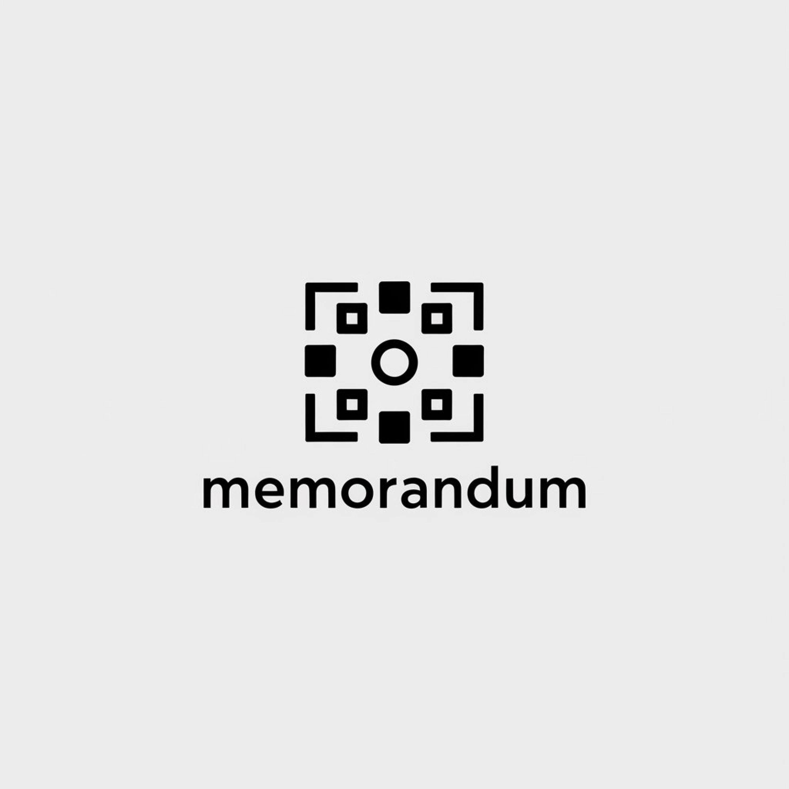

  <h1 align="center">Memorandum</h1>

  

# Memorandum: An Open-Source Alternative to Proprietary Databases

Memorandum is an open-source, self-hosted key-value storage system developed in response to recent changes in popular database licensing models (read [this](https://www.theregister.com/2024/03/22/redis_changes_license/) for details). This project aims to provide a straightforward, customizable, and community-driven alternative to proprietary solutions.
 

## Background

The recent shift towards more restrictive licensing models in some popular databases (more specifically redis) has led many developers to reconsider their approach to data storage. As a response to these changes, i've created Memorandum - a lightweight, easy-to-use key-value store that puts control firmly in the hands of its users. 

## Key Features

- **Open Source**: Built entirely on open-source technologies, ensuring transparency and freedom from restrictive licensing terms.
- **Simple API**: Intuitive interface for storing and retrieving data, making it easy to integrate into various projects.
- **Self-Hosted**: Run Memorandum on your own infrastructure, avoiding lock-in to any particular provider.
- **Customizable**: Modify the codebase to suit your specific needs or add features as required.

## Technical Details

- Written in Go, leveraging its performance and simplicity.
- Designed for ease of deployment and maintenance.
- Implemented as both a command-line interface and a network server.
- Utilizes a simple key-value structure with optional expiration support.

## Why Choose Memorandum?

1. **Avoid Licensing Risks**: By choosing an open-source solution, you mitigate risks associated with restrictive licensing terms.
2. **Full Control**: Self-hosting gives you complete control over your data and infrastructure.
3. **Flexibility**: Easy to customize and extend to meet specific project requirements.

## Getting Started

[Insert instructions for cloning, building, and running Memorandum]

## Disclaimer
This is a simple in-memory database implementation which was built as a hobby project and may not perform well under enterprise-level workload.

### TODOS:
- [ ] add WAL logs using binary format
- [ ] add logging capabilities and use log file instead of Println
- [ ] add graceful shutdown when app is terminated
- [ ] add Postmam collection / swagger docs or some sort of docs + improve CLI helps and docs
- [ ] add bash script or Makefile to simplify build and running process
- [ ] add details in README.md
- [ ] next level : add clustering and high Availability
